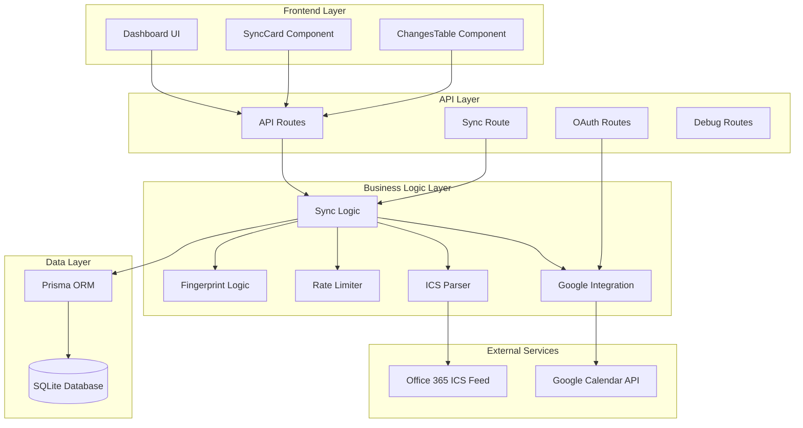
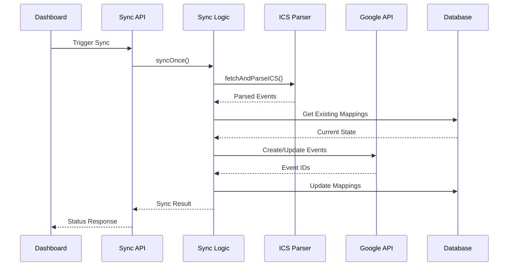
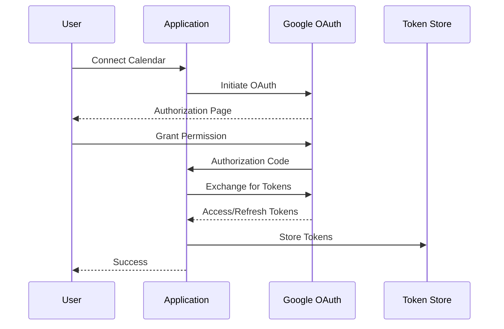
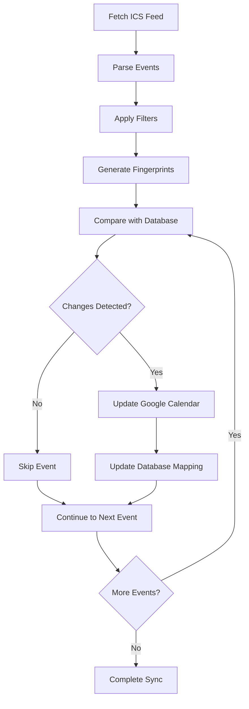

# System Architecture

## Overview

The Outlook ICS → Google Calendar Sync application follows a layered architecture with clear separation of concerns, built on Next.js 15 with TypeScript.

## Architecture Diagram

## Architectural Layers

### 1. Frontend Layer (#architecture #components)
- **Technology**: React with TypeScript, Tailwind CSS
- **Components**: Minimal UI with dashboard and sync status display
- **Pattern**: Server-side rendering with client-side interactivity
- **Responsibilities**: User interface, sync triggering, status display

### 2. API Layer (#api #architecture)
- **Technology**: Next.js App Router API routes
- **Pattern**: RESTful endpoints with extensive debugging routes
- **Key Routes**:
  - `/api/sync` - Manual sync trigger
  - `/api/google/oauth/*` - Authentication flow
  - `/api/status` - System status
  - 50+ debug/testing routes
- **Responsibilities**: HTTP request handling, authentication, API orchestration

### 3. Business Logic Layer (#components #workflow)
- **Core Modules**:
  - `sync.ts` - Main orchestration logic
  - `google.ts` - Google Calendar integration
  - `ics.ts` - ICS feed parsing and filtering
  - `rate-limiter.ts` - API rate limiting
  - `fingerprint.ts` - Change detection
- **Pattern**: Service-oriented with dependency injection
- **Responsibilities**: Business rules, data transformation, external service coordination

### 4. Data Layer (#data #architecture)
- **Technology**: Prisma ORM with SQLite
- **Pattern**: Active Record with migrations
- **Models**: Mapping, Token, SyncLog
- **Responsibilities**: Data persistence, relationship management, query optimization

## Design Patterns

### 1. Event-Driven Sync (#workflow #architecture)

### 2. Change Detection (#components #workflow)
- **Fingerprinting**: SHA-256 hash of event properties
- **Comparison**: Database-stored vs current fingerprints
- **Optimization**: Only sync changed events

### 3. Rate Limiting (#architecture #integration)
- **Pattern**: Token bucket algorithm
- **Implementation**: Custom rate limiter for Google Calendar API
- **Configuration**: Respects Google API quotas

### 4. OAuth2 Flow (#auth #workflow)

## Data Flow Architecture

### 1. Sync Process Flow (#workflow #data)

### 2. Error Handling Strategy (#architecture #workflow)
- **Graceful Degradation**: Continue sync on individual event failures
- **Comprehensive Logging**: Database-stored sync logs with error details
- **Retry Logic**: Built into Google API client
- **User Feedback**: Dashboard displays sync status and errors

## Scalability Considerations

### 1. Performance Optimizations (#architecture)
- **Batch Processing**: Events processed in batches
- **Change Detection**: Avoid unnecessary API calls
- **Rate Limiting**: Prevent API quota exhaustion
- **Database Indexing**: Optimized queries on UIDs and dates

### 2. Deployment Architecture (#architecture)
- **Stateless Design**: No server-side session state
- **Database**: Single SQLite file (suitable for single-user)
- **Cron Support**: Built-in scheduling capabilities
- **Environment Configuration**: Extensive environment variable support

## Security Architecture

### 1. Authentication (#auth #architecture)
- **OAuth2**: Industry-standard Google authentication
- **Token Storage**: Encrypted database storage
- **Refresh Tokens**: Automatic token renewal
- **Scope Limitation**: Minimal required permissions

### 2. Data Protection (#architecture #data)
- **Local Storage**: SQLite database on local filesystem
- **No PII Exposure**: Event data stays within user's control
- **API Security**: Rate limiting and error handling

## Extension Points

### 1. Additional Calendar Providers (#architecture #integration)
- **Interface**: Abstract calendar provider interface
- **Implementation**: Google-specific implementation
- **Extension**: Easy to add other providers (Outlook, CalDAV)

### 2. Custom Filtering (#architecture #components)
- **Plugin System**: Configurable event filters
- **Environment Variables**: Runtime configuration
- **Custom Logic**: Extensible filtering rules

### 3. Notification Systems (#architecture)
- **Webhook Support**: Ready for webhook integrations
- **Logging Interface**: Structured logging for monitoring
- **Status API**: Machine-readable status endpoints
