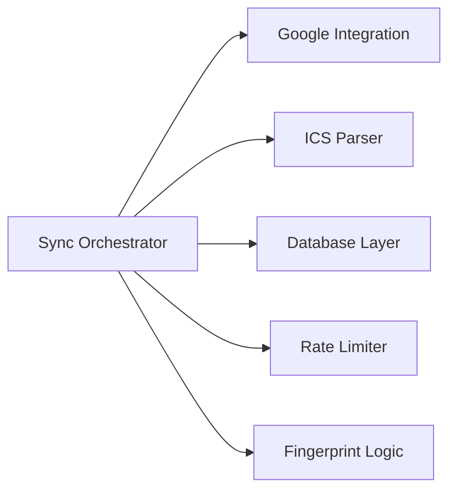
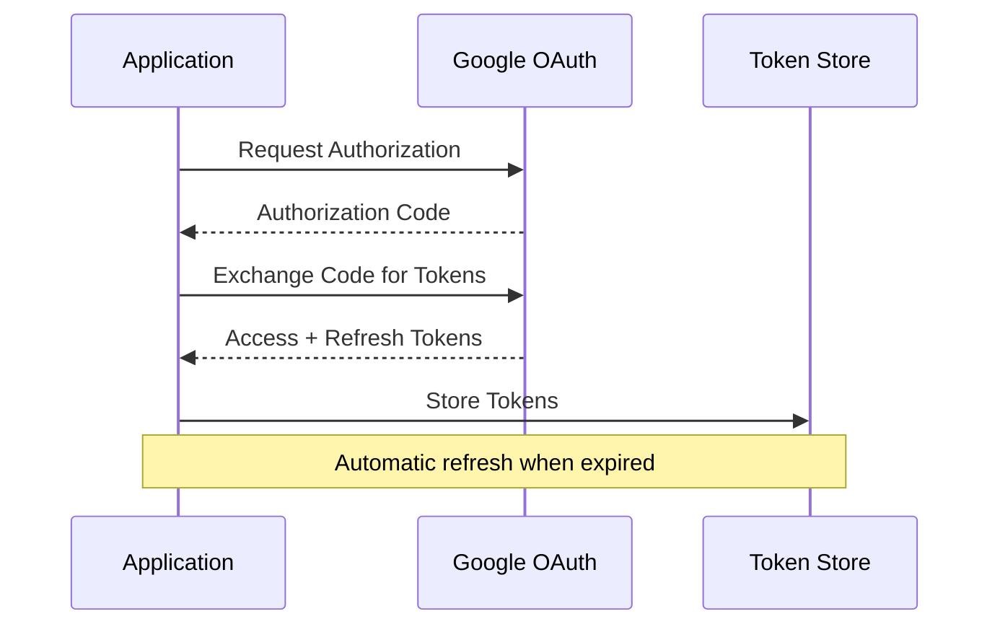
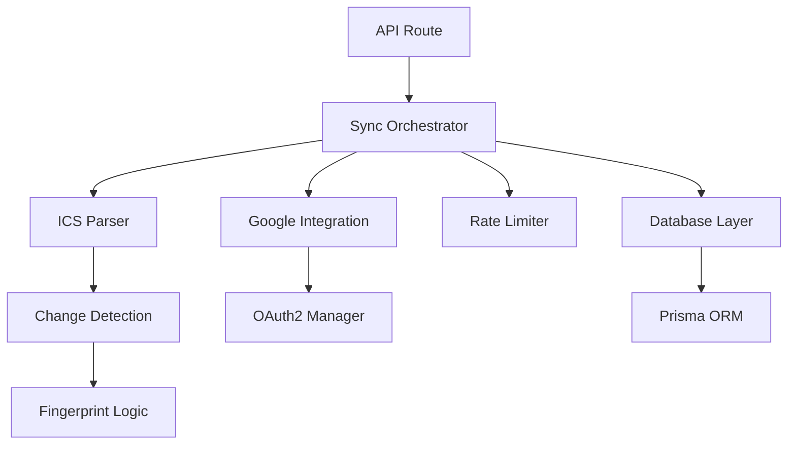
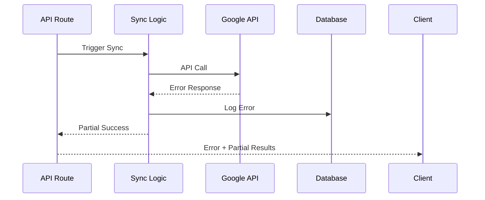

# Major Components

## Core Business Logic Components

### 1. Sync Orchestrator (`lib/sync.ts`) (#components #workflow)

**Primary Responsibility**: Main synchronization orchestration and coordination

**Key Functions**:
- `syncOnce()` - Main sync entry point
- `fetchAndParseICSWithRecurrence()` - ICS processing with recurring event support
- `processEvents()` - Event processing pipeline
- `handleRecurringExceptions()` - Recurring event exception handling

**Dependencies**: Google API, ICS Parser, Database, Rate Limiter

**Component Relationships**:


### 2. Google Calendar Integration (`lib/google.ts`) (#components #integration)

**Primary Responsibility**: Google Calendar API integration and OAuth management

**Key Functions**:
- `getAuthenticatedCalendar()` - OAuth2 authentication
- `createGoogleEventBody()` - Event format conversion
- `storeTokens()` / `getStoredTokens()` - Token management
- `refreshAccessToken()` - Token refresh logic

**OAuth2 Flow**:


### 3. ICS Feed Parser (`lib/ics.ts`) (#components #data)

**Primary Responsibility**: ICS feed fetching, parsing, and intelligent filtering

**Key Functions**:
- `fetchAndParseICS()` - Main parsing entry point
- `shouldSkipEvent()` - Event filtering logic
- `generateFingerprint()` - Change detection
- `parseRecurringEvents()` - Recurring event handling

**Filtering Rules**:
- Skip declined meetings (PARTSTAT=DECLINED)
- Skip tentative events (Microsoft CDO status)
- Skip custom title patterns (environment configurable)
- Skip cancelled/declined events

### 4. Rate Limiter (`lib/rate-limiter.ts`) (#components #integration)

**Primary Responsibility**: Google Calendar API rate limiting and quota management

**Implementation**: Token bucket algorithm with configurable limits

**Key Features**:
- Respects Google Calendar API quotas
- Prevents API exhaustion
- Configurable rate limits
- Automatic backoff on quota exceeded

### 5. Change Detection (`lib/fingerprint.ts`) (#components #workflow)

**Primary Responsibility**: Event change detection using content fingerprinting

**Algorithm**: SHA-256 hash of normalized event properties

**Tracked Properties**:
- Event title and description
- Start/end times
- Attendees and organizer
- Location and status

## UI Components

### 1. Sync Status Card (`components/SyncCard.tsx`) (#components #ui)

**Primary Responsibility**: Display sync status and trigger manual syncs

**Features**:
- Real-time sync status
- Manual sync trigger
- Error display
- Last sync timestamp

**State Management**: React hooks with API integration

### 2. Changes Table (`components/ChangesTable.tsx`) (#components #ui)

**Primary Responsibility**: Display sync history and event changes

**Features**:
- Tabular sync log display
- Event change details
- Error information
- Pagination support

## API Route Components

### 1. Core API Routes (#api #components)

**Sync Route** (`/api/sync`):
- Triggers manual synchronization
- Returns sync results
- Error handling and logging

**Status Route** (`/api/status`):
- System configuration display
- Authentication status
- Last sync information

**OAuth Routes** (`/api/google/oauth/*`):
- OAuth2 flow initiation
- Callback handling
- Token management

### 2. Debug API Routes (#api #components)

**Extensive Debug Suite** (50+ routes):
- Event inspection endpoints
- ICS feed analysis
- Calendar comparison tools
- Data validation utilities

**Examples**:
- `/api/debug-raw-ics` - Raw ICS feed inspection
- `/api/check-cancelled` - Cancelled event detection
- `/api/compare-events` - Event comparison utilities

## Database Components

### 1. Data Models (`prisma/schema.prisma`) (#data #components)

**Mapping Model**:
```prisma
model Mapping {
  id            String   @id @default(cuid())
  uid           String   @unique
  googleEventId String
  fingerprint   String
  isException   Boolean  @default(false)
  originalUid   String?
  exceptionDate DateTime?
}
```

**Token Model**:
```prisma
model Token {
  id           Int      @id @default(1)
  accessToken  String
  refreshToken String
  expiryDate   DateTime
  scopes       String?
}
```

**SyncLog Model**:
```prisma
model SyncLog {
  id         Int      @id @default(autoincrement())
  startedAt  DateTime @default(now())
  finishedAt DateTime?
  status     String
  summary    String
  created    Int      @default(0)
  updated    Int      @default(0)
  deleted    Int      @default(0)
  errors     String?
}
```

## Component Interaction Patterns

### 1. Sync Process Flow (#workflow #components)



### 2. Error Handling Chain (#components #workflow)



## Component Configuration

### 1. Environment-Driven Configuration (#components #integration)

**Required Variables**:
- `ICS_URL` - Office 365 ICS feed URL
- `GOOGLE_CLIENT_ID` / `GOOGLE_CLIENT_SECRET` - OAuth credentials
- `GOOGLE_CALENDAR_ID` - Target calendar
- `DATABASE_URL` - SQLite database path

**Optional Variables**:
- `MY_EMAIL` - For attendee filtering
- `SKIP_EVENT_TITLES` - Custom event filtering
- `GOOGLE_REDIRECT_URI` - OAuth redirect URL

### 2. Runtime Configuration (#components)

**Database Connection**: Automatic Prisma client initialization
**Google API Client**: Lazy initialization with token refresh
**Rate Limiting**: Configurable limits per component
**Logging**: Structured logging with database persistence

## Extension and Customization Points

### 1. Custom Filters (#components #workflow)
- Event filtering interface in `ics.ts`
- Environment variable configuration
- Pluggable filter functions

### 2. Additional Calendar Providers (#components #integration)
- Abstract calendar interface
- Provider-specific implementations
- Unified sync orchestration

### 3. Enhanced UI Components (#components #ui)
- Component composition patterns
- Shared state management
- API integration hooks
