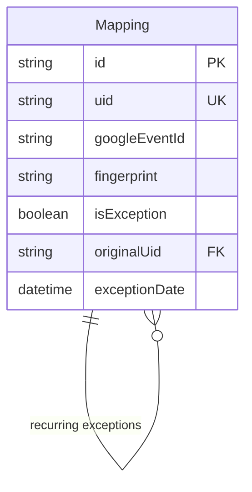
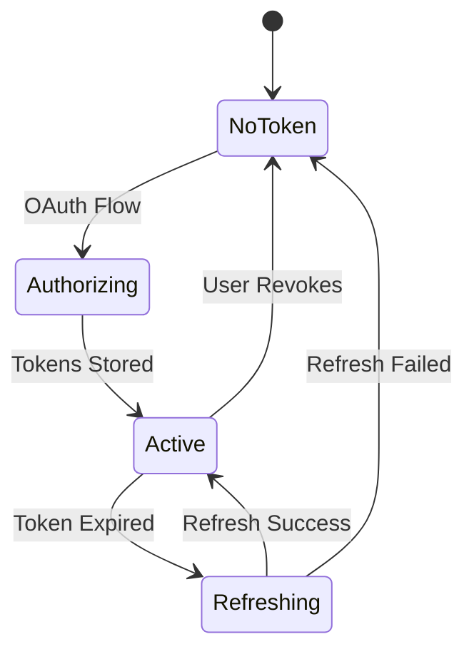
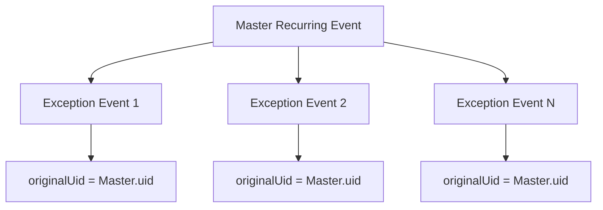
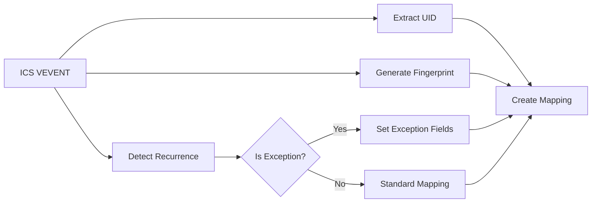

# Data Models and Database Schema

## Database Schema Overview

The application uses SQLite with Prisma ORM for data persistence. The schema supports event mapping, OAuth token storage, and comprehensive sync logging.

## Core Data Models

### 1. Event Mapping Model (#data #models)

**Purpose**: Maps ICS event UIDs to Google Calendar event IDs with change tracking

```prisma
model Mapping {
  id            String   @id @default(cuid())
  uid           String   @unique
  googleEventId String
  fingerprint   String
  // Recurring event support
  isException   Boolean  @default(false)
  originalUid   String?  // Links to master recurring event
  exceptionDate DateTime? // When this exception occurs
  createdAt     DateTime @default(now())
  updatedAt     DateTime @updatedAt

  @@index([uid])
  @@index([originalUid])
}
```

**Key Fields**:
- `uid`: Unique identifier from ICS feed (RFC 5545 UID property)
- `googleEventId`: Corresponding Google Calendar event ID
- `fingerprint`: SHA-256 hash for change detection
- `isException`: Flag for recurring event exceptions
- `originalUid`: Parent recurring event UID (for exceptions)
- `exceptionDate`: Specific date for recurring exceptions

**Relationships**:


### 2. OAuth Token Model (#data #auth)

**Purpose**: Stores Google OAuth 2.0 tokens for API authentication

```prisma
model Token {
  id           Int      @id @default(1)
  accessToken  String
  refreshToken String
  expiryDate   DateTime
  scopes       String?
  createdAt    DateTime @default(now())
  updatedAt    DateTime @updatedAt
}
```

**Key Fields**:
- `id`: Fixed to 1 (single-user application)
- `accessToken`: Current Google API access token
- `refreshToken`: Long-lived refresh token
- `expiryDate`: Access token expiration timestamp
- `scopes`: Granted OAuth scopes (JSON string)

**Token Lifecycle**:


### 3. Sync Log Model (#data #logging)

**Purpose**: Comprehensive logging of sync operations and results

```prisma
model SyncLog {
  id         Int      @id @default(autoincrement())
  startedAt  DateTime @default(now())
  finishedAt DateTime?
  status     String  // SUCCESS, ERROR, or PARTIAL
  summary    String
  created    Int      @default(0)
  updated    Int      @default(0)
  deleted    Int      @default(0)
  errors     String?  // JSON string of error array
  createdAt  DateTime @default(now())

  @@index([startedAt])
}
```

**Key Fields**:
- `status`: Sync outcome (SUCCESS, ERROR, PARTIAL)
- `summary`: Human-readable sync description
- `created/updated/deleted`: Event operation counts
- `errors`: JSON array of error messages and details
- `startedAt/finishedAt`: Sync timing information

## Data Relationships and Constraints

### 1. Event Mapping Relationships (#data #relationships)

**Master-Exception Relationship**:


**Constraints**:
- `uid` must be unique across all mappings
- `originalUid` must reference existing mapping for exceptions
- `exceptionDate` required when `isException = true`
- Indexes on `uid` and `originalUid` for performance

### 2. Data Integrity Rules (#data #constraints)

**Mapping Constraints**:
- One-to-one mapping between ICS UID and Google Event ID
- Fingerprint must be non-empty for change detection
- Exception events must have valid parent reference

**Token Constraints**:
- Single token record (id = 1)
- Access token and refresh token must be non-empty
- Expiry date must be future timestamp for valid tokens

## Data Transformation Patterns

### 1. ICS Event to Database Mapping (#data #transformation)

**Input**: ICS VEVENT object
**Output**: Mapping record with fingerprint

```typescript
interface ICSToMappingTransform {
  input: {
    uid: string
    vevent: VEvent
    isRecurring: boolean
    isException: boolean
    parentUid?: string
    exceptionDate?: Date
  }
  output: {
    uid: string
    fingerprint: string
    isException: boolean
    originalUid?: string
    exceptionDate?: Date
  }
}
```

**Transformation Process**:


### 2. Fingerprint Generation Algorithm (#data #fingerprint)

**Purpose**: Detect changes in event content for efficient syncing

**Input Properties**:
- Event summary (title)
- Event description
- Start/end timestamps
- Attendee list
- Location
- Organizer

**Algorithm**:
```typescript
function generateFingerprint(vevent: VEvent): string {
  const normalized = {
    summary: vevent.summary?.trim() || '',
    description: vevent.description?.trim() || '',
    start: vevent.start?.toISOString() || '',
    end: vevent.end?.toISOString() || '',
    attendees: normalizeAttendees(vevent.attendee),
    location: vevent.location?.trim() || '',
    organizer: vevent.organizer?.val || ''
  }
  
  return sha256(JSON.stringify(normalized))
}
```

## Query Patterns and Optimization

### 1. Common Query Patterns (#data #queries)

**Find Existing Mapping**:
```sql
SELECT * FROM Mapping WHERE uid = ? LIMIT 1;
```

**Get Recurring Event Exceptions**:
```sql
SELECT * FROM Mapping 
WHERE originalUid = ? AND isException = true
ORDER BY exceptionDate;
```

**Recent Sync Logs**:
```sql
SELECT * FROM SyncLog 
ORDER BY startedAt DESC 
LIMIT 10;
```

**Active Token**:
```sql
SELECT * FROM Token WHERE id = 1 LIMIT 1;
```

### 2. Performance Optimizations (#data #performance)

**Indexes**:
- `uid` index for fast mapping lookups
- `originalUid` index for recurring event queries
- `startedAt` index for sync log chronological queries

**Query Optimization**:
- Batch operations for multiple event processing
- Prepared statements for repeated queries
- Connection pooling (single connection for SQLite)

## Data Migration and Versioning

### 1. Schema Evolution (#data #migration)

**Prisma Migration Strategy**:
- Incremental schema changes
- Automatic migration generation
- Development vs production migration handling

**Version History**:
- v1.0: Basic mapping and token storage
- v1.1: Added sync logging
- v1.2: Recurring event exception support

### 2. Data Backup and Recovery (#data #backup)

**SQLite Backup Strategy**:
- File-based backup (copy dev.db)
- Export to SQL dump
- Prisma schema regeneration

**Recovery Procedures**:
- Database file restoration
- Schema migration replay
- Token re-authentication if needed

## Data Security and Privacy

### 1. Sensitive Data Handling (#data #security)

**Token Encryption**: 
- Stored in database (consider encryption at rest)
- No tokens in logs or error messages
- Automatic token refresh

**Event Data Privacy**:
- Local SQLite storage only
- No external data transmission except to Google
- User controls all data retention

### 2. Data Retention Policies (#data #retention)

**Mapping Data**: Retained indefinitely for sync continuity
**Sync Logs**: Configurable retention (default: unlimited)
**Token Data**: Retained until user disconnects or revokes access

## Future Data Model Extensions

### 1. Multi-User Support (#data #future)

**Planned Schema Changes**:
```prisma
model User {
  id       String @id @default(cuid())
  email    String @unique
  mappings Mapping[]
  tokens   Token[]
  syncLogs SyncLog[]
}

model Mapping {
  // ... existing fields
  userId String
  user   User @relation(fields: [userId], references: [id])
}
```

### 2. Multiple Calendar Support (#data #future)

**Calendar Model**:
```prisma
model Calendar {
  id          String @id @default(cuid())
  googleId    String
  name        String
  icsUrl      String
  userId      String
  mappings    Mapping[]
}
```

### 3. Enhanced Logging (#data #future)

**Detailed Event Logs**:
```prisma
model EventLog {
  id        String @id @default(cuid())
  mappingId String
  operation String // CREATE, UPDATE, DELETE
  timestamp DateTime
  changes   String // JSON diff
  syncLogId Int
}
```
