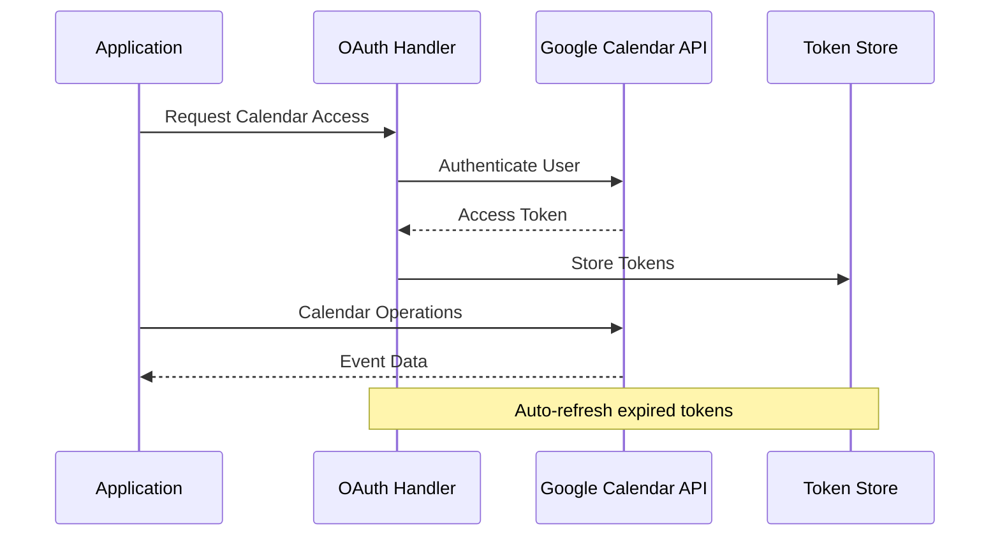
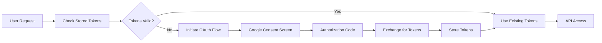
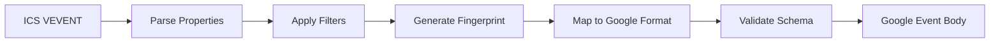

# APIs, Interfaces, and Integration Points

## External API Integrations

### 1. Google Calendar API (#integration #api)

**Base URL**: `https://www.googleapis.com/calendar/v3`

**Authentication**: OAuth 2.0 with refresh tokens

**Key Endpoints Used**:
- `GET /calendars/{calendarId}/events` - List events
- `POST /calendars/{calendarId}/events` - Create events  
- `PUT /calendars/{calendarId}/events/{eventId}` - Update events
- `DELETE /calendars/{calendarId}/events/{eventId}` - Delete events

**Rate Limits**: 
- 1,000 requests per 100 seconds per user
- 10,000 requests per 100 seconds

**Integration Pattern**:


### 2. Office 365 ICS Feed (#integration #api)

**Protocol**: HTTP/HTTPS with ICS (iCalendar) format

**URL Pattern**: `webcal://outlook.office365.com/.../calendar.ics`

**Data Format**: RFC 5545 iCalendar standard

**Key Properties Parsed**:
- `VEVENT` - Event objects
- `DTSTART/DTEND` - Event timing
- `SUMMARY` - Event title
- `DESCRIPTION` - Event details
- `ATTENDEE` - Participant information
- `RRULE` - Recurrence rules
- `EXDATE` - Exception dates

## Internal API Interfaces

### 1. Sync API Interface (#api #interfaces)

**Endpoint**: `POST /api/sync`

**Request**: No body required

**Response**:
```typescript
interface SyncResult {
  created: number
  updated: number  
  deleted: number
  startedAt: Date
  finishedAt: Date
  errors: string[]
}
```

**Error Handling**: Returns partial results with error details

### 2. Status API Interface (#api #interfaces)

**Endpoint**: `GET /api/status`

**Response**:
```typescript
interface SystemStatus {
  isAuthenticated: boolean
  lastSync?: Date
  configuration: {
    icsUrl: string
    calendarId: string
    myEmail?: string
  }
  stats: {
    totalMappings: number
    lastSyncResult?: SyncResult
  }
}
```

### 3. OAuth API Interface (#auth #api)

**Initiate**: `GET /api/google/oauth/initiate`
- Redirects to Google OAuth consent screen
- Includes required scopes and redirect URI

**Callback**: `GET /api/google/oauth/callback`
- Handles OAuth authorization code
- Exchanges code for access/refresh tokens
- Stores tokens in database

## Data Interfaces and Contracts

### 1. Event Data Interface (#interfaces #data)

**Parsed Event Structure**:
```typescript
interface ParsedEvent {
  uid: string           // Unique event identifier
  vevent: VEvent       // Raw iCalendar event object
  fingerprint: string  // SHA-256 hash for change detection
}

interface RecurringParsedEvent extends ParsedEvent {
  rrule: string        // Recurrence rule
}

interface RecurringExceptionEvent extends ParsedEvent {
  originalUid: string  // Parent recurring event UID
  exceptionDate: Date  // Exception occurrence date
  isException: boolean // Exception flag
}
```

**Google Event Body**:
```typescript
interface GoogleEventBody {
  summary: string
  description?: string
  start: {
    dateTime?: string
    date?: string
    timeZone?: string
  }
  end: {
    dateTime?: string
    date?: string
    timeZone?: string
  }
  attendees?: Array<{
    email: string
    displayName?: string
    responseStatus?: string
  }>
  recurrence?: string[]
}
```

### 2. Database Interface Contracts (#interfaces #data)

**Mapping Interface**:
```typescript
interface EventMapping {
  id: string
  uid: string           // ICS event UID
  googleEventId: string // Google Calendar event ID
  fingerprint: string   // Change detection hash
  isException: boolean  // Recurring exception flag
  originalUid?: string  // Parent recurring event
  exceptionDate?: Date  // Exception date
}
```

**Token Interface**:
```typescript
interface StoredToken {
  id: number
  accessToken: string
  refreshToken: string
  expiryDate: Date
  scopes?: string
}
```

## Integration Patterns

### 1. OAuth 2.0 Flow (#auth #integration)



### 2. Rate Limiting Integration (#integration #api)

**Implementation**: Token bucket algorithm

**Configuration**:
```typescript
interface RateLimiterConfig {
  maxRequests: number    // Maximum requests in window
  windowMs: number       // Time window in milliseconds
  skipSuccessfulRequests: boolean
  skipFailedRequests: boolean
}
```

**Usage Pattern**:
```typescript
await googleCalendarRateLimiter.acquire()
const result = await calendar.events.insert(params)
```

### 3. Error Handling Interface (#interfaces #integration)

**Error Response Structure**:
```typescript
interface APIError {
  code: string
  message: string
  details?: any
  timestamp: Date
}

interface SyncError extends APIError {
  eventUid?: string
  operation: 'create' | 'update' | 'delete'
  retryable: boolean
}
```

## Data Transformation Interfaces

### 1. ICS to Google Event Mapping (#interfaces #data)

**Transformation Pipeline**:


**Key Transformations**:
- Date/time format conversion (ISO 8601)
- Timezone handling (IANA to Google)
- Attendee format mapping
- Recurrence rule conversion
- All-day event detection

### 2. Change Detection Interface (#interfaces #workflow)

**Fingerprint Generation**:
```typescript
interface FingerprintInput {
  summary: string
  description?: string
  start: Date
  end: Date
  attendees?: string[]
  location?: string
}

function generateFingerprint(input: FingerprintInput): string {
  // SHA-256 hash of normalized properties
}
```

## External Service Dependencies

### 1. Google Services Integration (#integration #dependencies)

**Required Scopes**:
- `https://www.googleapis.com/auth/calendar` - Full calendar access
- `https://www.googleapis.com/auth/calendar.events` - Event management

**Client Configuration**:
```typescript
interface GoogleClientConfig {
  clientId: string
  clientSecret: string
  redirectUri: string
  scopes: string[]
}
```

### 2. Office 365 Integration (#integration #dependencies)

**ICS Feed Requirements**:
- Public webcal:// or https:// URL
- Standard iCalendar format (RFC 5545)
- Regular updates (typically every 15 minutes)

**Supported Event Types**:
- Single events
- Recurring events with RRULE
- Recurring exceptions with EXDATE
- All-day events
- Multi-day events

## API Security and Validation

### 1. Input Validation (#interfaces #api)

**Environment Variables**:
- URL validation for ICS feeds
- Email format validation
- Required vs optional parameters

**Request Validation**:
- CSRF protection (Next.js built-in)
- Rate limiting per endpoint
- Input sanitization

### 2. Token Security (#auth #interfaces)

**Storage**: Encrypted database storage
**Rotation**: Automatic refresh token rotation
**Expiration**: Proactive token refresh before expiry
**Scopes**: Minimal required permissions

## Webhook and Event Interfaces

### 1. Future Webhook Support (#interfaces #integration)

**Planned Interface**:
```typescript
interface WebhookPayload {
  eventType: 'sync.completed' | 'sync.failed' | 'auth.expired'
  timestamp: Date
  data: SyncResult | Error
}
```

### 2. Monitoring Interface (#interfaces #api)

**Health Check Endpoint**: `GET /api/health`
**Metrics Endpoint**: `GET /api/metrics`
**Logs Endpoint**: `GET /api/logs`
