# Key Processes and Workflows

## Primary Sync Workflow

### 1. Complete Sync Process (#workflow #sync)

The main synchronization workflow orchestrates the entire process from ICS fetch to Google Calendar updates.

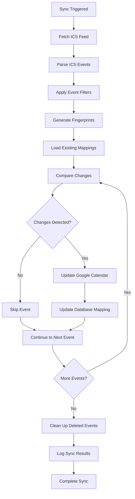

**Key Steps**:
1. **ICS Fetch**: Download and parse Office 365 ICS feed
2. **Event Filtering**: Apply business rules to skip unwanted events
3. **Change Detection**: Compare fingerprints to detect modifications
4. **Google API Operations**: Create, update, or delete events
5. **Database Updates**: Maintain mapping and logging records
6. **Cleanup**: Remove mappings for deleted events

### 2. Event Processing Pipeline (#workflow #events)

Each event goes through a standardized processing pipeline:

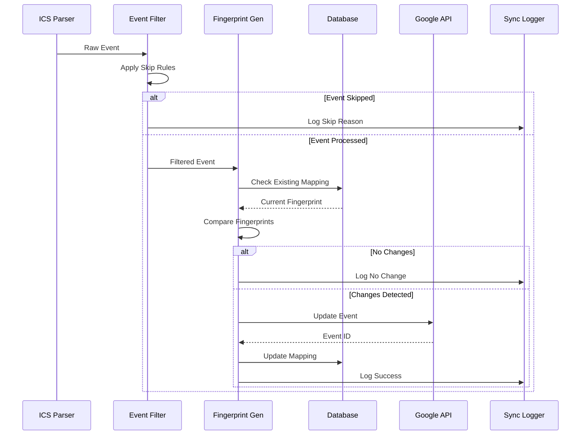

## Authentication Workflow

### 1. OAuth 2.0 Flow (#workflow #auth)

Complete OAuth authentication process for Google Calendar access:

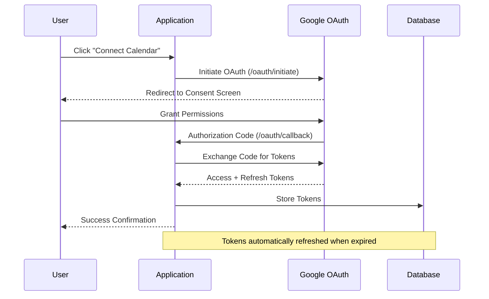

**OAuth Scopes Required**:
- `https://www.googleapis.com/auth/calendar` - Full calendar access
- `https://www.googleapis.com/auth/calendar.events` - Event management

### 2. Token Management Workflow (#workflow #auth)

Automatic token refresh and error handling:

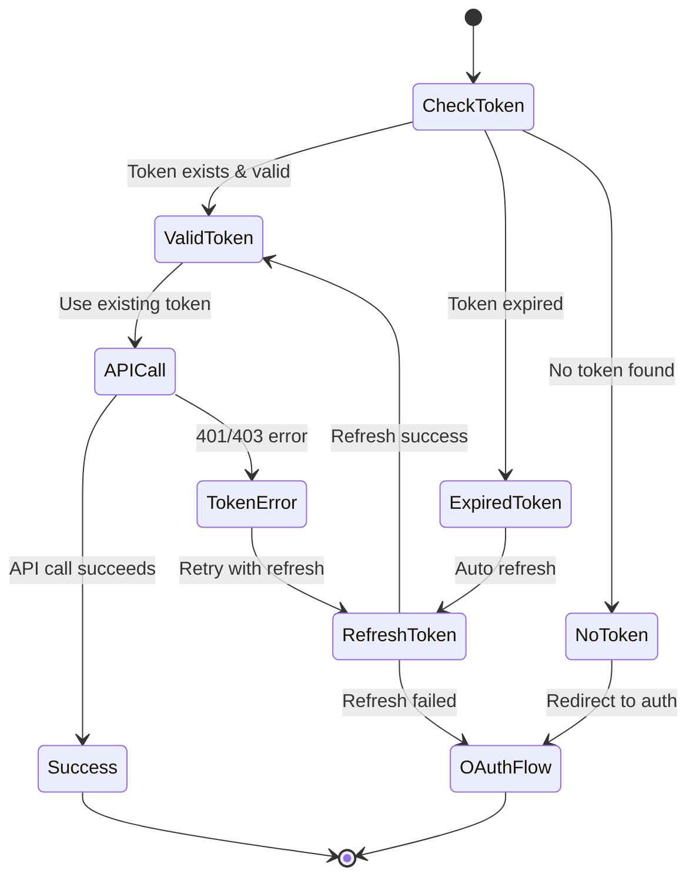

## Event Filtering Workflow

### 1. Multi-Stage Filtering Process (#workflow #filtering)

Events are filtered through multiple stages to ensure only relevant events are synced:

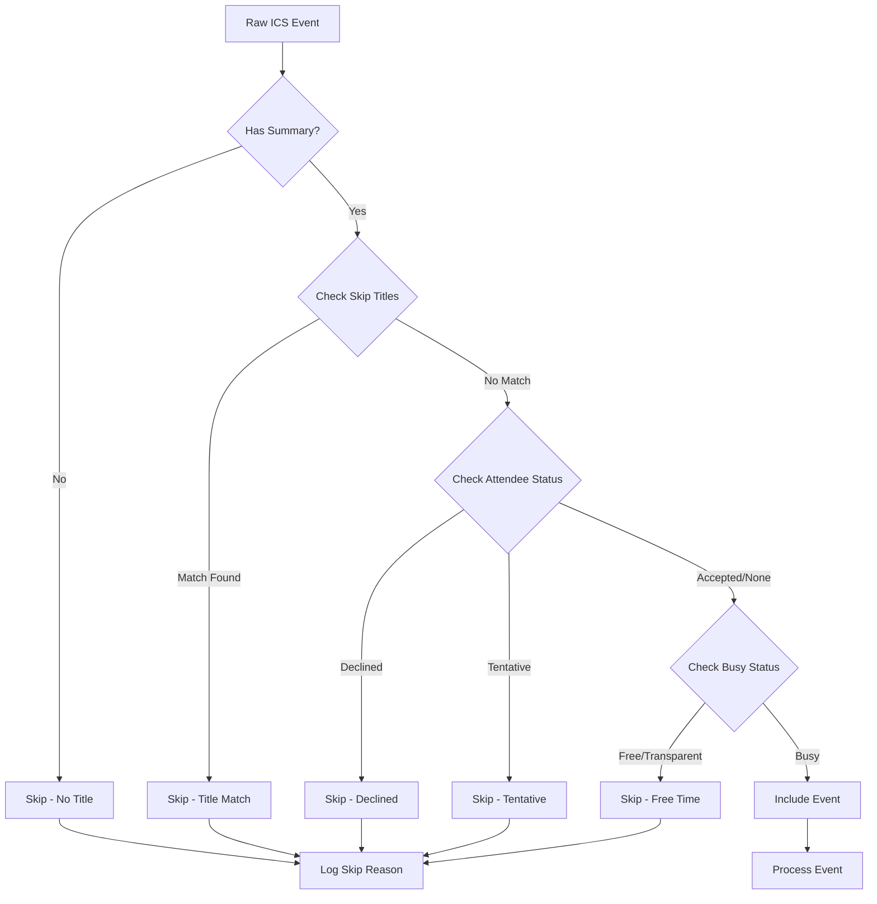

**Filter Categories**:

1. **Title-Based Filtering**:
   - Skip events with "Canceled:" or "Declined:" prefixes
   - Custom skip titles from `SKIP_EVENT_TITLES` environment variable

2. **Attendee Status Filtering**:
   - Skip if user has declined (`PARTSTAT=DECLINED`)
   - Skip if status is tentative (`X-MICROSOFT-CDO-BUSYSTATUS=TENTATIVE`)

3. **Availability Filtering**:
   - Skip free/transparent time blocks
   - Skip events marked as not busy

### 2. Recurring Event Handling (#workflow #recurring)

Special workflow for recurring events and exceptions:

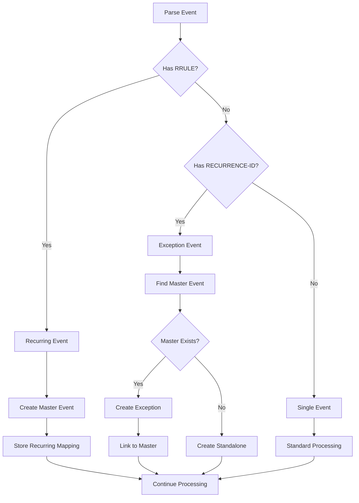

## Error Handling Workflows

### 1. Graceful Error Recovery (#workflow #errors)

The system implements comprehensive error handling with graceful degradation:

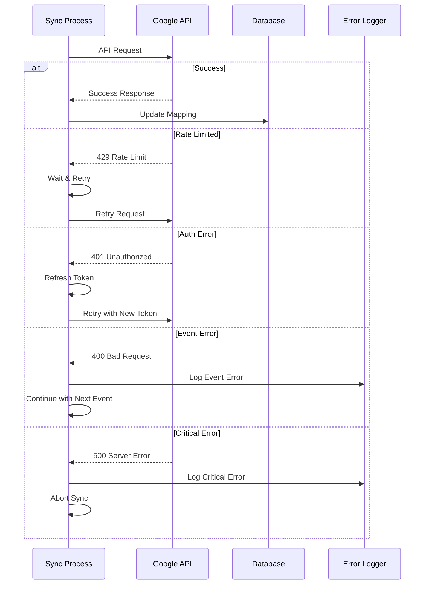

**Error Categories**:
- **Recoverable**: Rate limits, temporary auth issues
- **Event-Specific**: Invalid event data, conflicts
- **Critical**: Service unavailable, network failures

### 2. Partial Sync Recovery (#workflow #recovery)

When sync fails partially, the system maintains consistency:

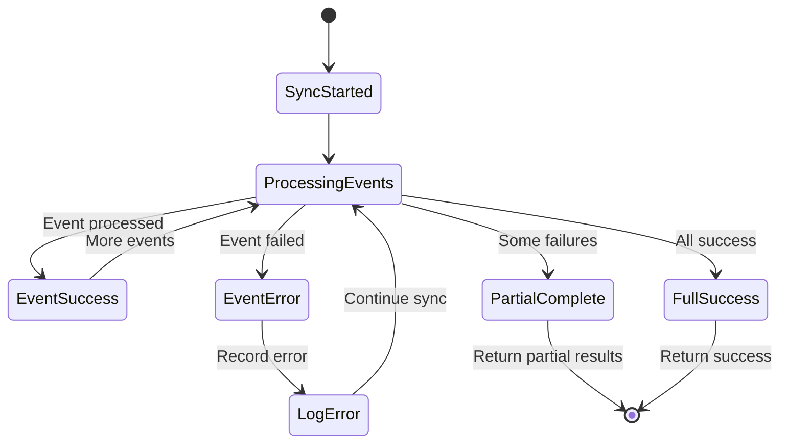

## Operational Workflows

### 1. Manual Sync Trigger (#workflow #manual)

User-initiated synchronization through the dashboard:

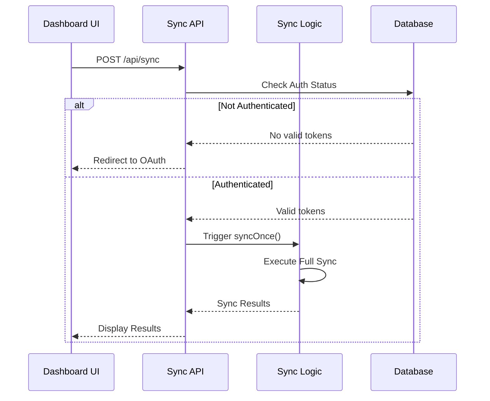

### 2. Automated Sync Scheduling (#workflow #automation)

Scheduled synchronization for continuous updates:

**Vercel Cron Jobs**:
```typescript
// vercel.json configuration
{
  "crons": [{
    "path": "/api/cron",
    "schedule": "0 7 * * *"  // Daily at 7 AM
  }]
}
```

**Self-Hosted Cron**:
```mermaid
graph LR
    A[System Cron] --> B[Node Cron Script]
    B --> C[Import Sync Logic]
    C --> D[Execute syncOnce()]
    D --> E[Log Results]
    E --> F[Handle Errors]
```

### 3. Cleanup and Maintenance (#workflow #maintenance)

Regular maintenance operations for data consistency:

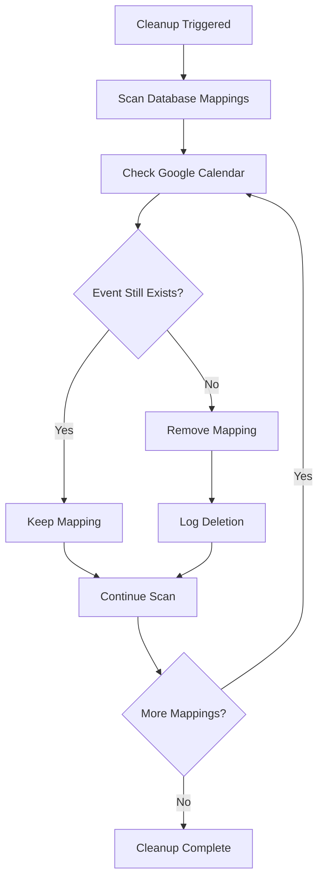

**Cleanup Operations**:
- Remove orphaned mappings
- Clean up old sync logs
- Validate token expiration
- Database optimization

## Development and Debug Workflows

### 1. Debug API Workflow (#workflow #debug)

Extensive debugging capabilities for development:

**Debug Endpoints**:
- `/api/debug-raw-ics` - Inspect raw ICS feed
- `/api/check-cancelled` - Analyze cancelled events
- `/api/compare-events` - Compare ICS vs Google events
- `/api/debug-allday` - All-day event debugging

### 2. Testing and Validation (#workflow #testing)

Comprehensive testing workflow for sync reliability:

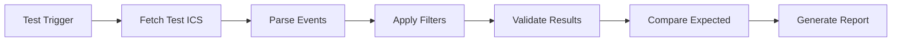

**Test Categories**:
- Event parsing accuracy
- Filter rule validation
- Google API integration
- Error handling scenarios
- Performance benchmarks
