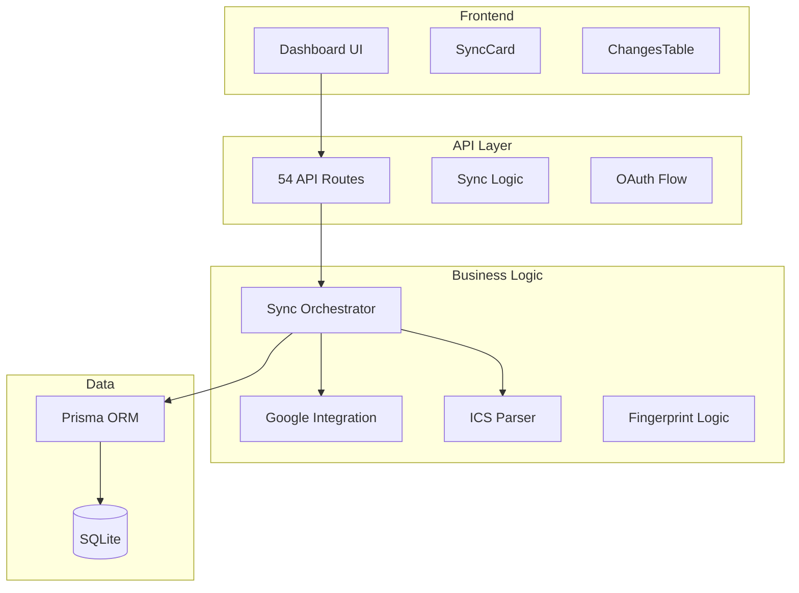

# AGENTS.md - AI Assistant Guide

This document provides comprehensive context for AI coding assistants working with the Outlook ICS → Google Calendar Sync application. It focuses on information not typically found in README.md or CONTRIBUTING.md files.

## Table of Contents

- [Project Context](#project-context)
- [Directory Structure & Organization](#directory-structure--organization)
- [Development Patterns](#development-patterns)
- [Testing Guidelines](#testing-guidelines)
- [Code Style & Conventions](#code-style--conventions)
- [Database Operations](#database-operations)
- [API Development](#api-development)
- [Error Handling Patterns](#error-handling-patterns)
- [Performance Considerations](#performance-considerations)
- [Security Guidelines](#security-guidelines)
- [Debugging & Troubleshooting](#debugging--troubleshooting)

## Project Context

### Application Purpose
One-way synchronization from Office 365 ICS feeds to Google Calendar with intelligent filtering and change detection. Built for single-user deployment with extensive debugging capabilities.

### Architecture Overview


### Key Technologies
- **Framework**: Next.js 15 with App Router
- **Language**: TypeScript (100% coverage)
- **Database**: SQLite with Prisma ORM
- **Authentication**: Google OAuth 2.0
- **Parsing**: node-ical for ICS processing
- **Styling**: Tailwind CSS

## Directory Structure & Organization

### Core Application Structure
```
/
├── app/                    # Next.js App Router
│   ├── api/               # 54 API endpoints (50+ debug routes)
│   │   ├── sync/          # Main sync endpoint
│   │   ├── google/oauth/  # OAuth flow
│   │   ├── status/        # System status
│   │   └── debug-*/       # Extensive debug endpoints
│   ├── layout.tsx         # Root layout with Tailwind
│   ├── page.tsx          # Dashboard with sync controls
│   └── globals.css       # Tailwind imports
├── components/            # React components
│   ├── SyncCard.tsx      # Sync status & trigger
│   └── ChangesTable.tsx  # Sync history display
├── lib/                  # Core business logic
│   ├── sync.ts          # Main orchestration (20KB+)
│   ├── google.ts        # Google Calendar API (15KB+)
│   ├── ics.ts           # ICS parsing & filtering (12KB+)
│   ├── rate-limiter.ts  # API rate limiting
│   ├── fingerprint.ts   # Change detection
│   └── db.ts            # Prisma client
├── prisma/              # Database schema
│   ├── schema.prisma    # SQLite schema
│   └── dev.db          # Database file
└── scripts/             # Utility scripts
    ├── cleanup-all.sh   # Complete system cleanup
    └── cron.ts         # Scheduled sync
```

### File Organization Patterns

**API Routes**: Extensive debug API structure with 50+ endpoints for testing and validation
**Business Logic**: Separated into focused modules (sync, google, ics, etc.)
**Components**: Minimal UI with functional React components
**Database**: Single SQLite file with Prisma for type safety

## Development Patterns

### Component Architecture Pattern
```typescript
// Functional components with hooks
export default function SyncCard() {
  const [syncStatus, setSyncStatus] = useState<'idle' | 'syncing' | 'complete'>('idle')
  const [lastSync, setLastSync] = useState<Date | null>(null)
  
  const handleSync = async () => {
    setSyncStatus('syncing')
    try {
      const response = await fetch('/api/sync', { method: 'POST' })
      const result = await response.json()
      // Handle result
    } catch (error) {
      // Error handling
    } finally {
      setSyncStatus('idle')
    }
  }
  
  return (
    // JSX with Tailwind classes
  )
}
```

### API Route Pattern
```typescript
// app/api/*/route.ts
import { NextRequest, NextResponse } from 'next/server'
import { syncOnce } from '@/lib/sync'

export async function POST(request: NextRequest) {
  try {
    const result = await syncOnce()
    return NextResponse.json(result)
  } catch (error) {
    console.error('Sync failed:', error)
    return NextResponse.json(
      { error: 'Sync failed', details: error.message },
      { status: 500 }
    )
  }
}
```

### Business Logic Pattern
```typescript
// lib/*.ts modules
export async function syncOnce(): Promise<SyncResult> {
  const startedAt = new Date()
  const errors: string[] = []
  
  try {
    // 1. Fetch and parse ICS
    const { parsedEvents } = await fetchAndParseICS(icsUrl, { myEmail })
    
    // 2. Process each event
    for (const event of parsedEvents) {
      await processEvent(event)
    }
    
    // 3. Return results
    return { created, updated, deleted, startedAt, finishedAt: new Date(), errors }
  } catch (error) {
    // Error handling with partial results
  }
}
```

## Testing Guidelines

### Manual Testing Approach
The application uses extensive debug API endpoints rather than automated tests:

**Debug Endpoints for Testing**:
- `/api/debug-raw-ics` - Inspect raw ICS feed data
- `/api/check-cancelled` - Validate cancelled event detection
- `/api/compare-events` - Compare ICS vs Google Calendar events
- `/api/debug-allday` - Test all-day event handling
- `/api/check-missing` - Identify missing events

### Testing Workflow
```typescript
// Example debug endpoint pattern
export async function GET() {
  try {
    const icsUrl = process.env.ICS_URL
    const response = await fetch(icsUrl)
    const icsData = await response.text()
    
    // Parse and analyze
    const parsed = parseICS(icsData)
    const events = Object.values(parsed).filter(item => item.type === 'VEVENT')
    
    return NextResponse.json({
      totalEvents: events.length,
      sampleEvent: events[0],
      analysis: {
        // Detailed analysis
      }
    })
  } catch (error) {
    return NextResponse.json({ error: error.message }, { status: 500 })
  }
}
```

### Validation Patterns
- **ICS Feed Validation**: Check feed accessibility and format
- **Event Filtering**: Validate skip rules and attendee status
- **Google API Integration**: Test authentication and CRUD operations
- **Change Detection**: Verify fingerprint generation and comparison

## Code Style & Conventions

### TypeScript Patterns
```typescript
// Interface definitions
interface SyncResult {
  created: number
  updated: number
  deleted: number
  startedAt: Date
  finishedAt: Date
  errors: string[]
}

// Async/await pattern
export async function fetchAndParseICS(
  icsUrl: string, 
  options: ICSFilterOptions = {}
): Promise<{ parsedEvents: ParsedEvent[] }> {
  // Implementation
}

// Error handling with types
try {
  const result = await operation()
} catch (error) {
  if (error instanceof GoogleAPIError) {
    // Handle Google API specific errors
  } else {
    // Handle generic errors
  }
}
```

### Naming Conventions
- **Files**: kebab-case for API routes, camelCase for components
- **Functions**: camelCase with descriptive verbs (fetchAndParseICS, shouldSkipEvent)
- **Interfaces**: PascalCase with descriptive names (ParsedEvent, SyncResult)
- **Constants**: UPPER_SNAKE_CASE for environment variables

### Import Organization
```typescript
// External libraries first
import { google } from 'googleapis'
import { parseICS } from 'node-ical'

// Internal modules
import { prisma } from './db'
import { generateFingerprint } from './fingerprint'

// Types
import type { VEvent } from 'node-ical'
```

## Database Operations

### Prisma Patterns
```typescript
// Standard CRUD operations
const mapping = await prisma.mapping.findUnique({
  where: { uid: eventUid }
})

const newMapping = await prisma.mapping.create({
  data: {
    uid: event.uid,
    googleEventId: googleEvent.id,
    fingerprint: event.fingerprint
  }
})

// Upsert pattern for tokens
await prisma.token.upsert({
  where: { id: 1 },
  update: { accessToken, refreshToken, expiryDate },
  create: { id: 1, accessToken, refreshToken, expiryDate }
})
```

### Database Schema Understanding
```prisma
model Mapping {
  id            String   @id @default(cuid())
  uid           String   @unique        // ICS event UID
  googleEventId String                  // Google Calendar event ID
  fingerprint   String                  // Change detection hash
  isException   Boolean  @default(false) // Recurring exception flag
  originalUid   String?                 // Parent recurring event
  exceptionDate DateTime?               // Exception date
}
```

### Migration Patterns
```bash
# Generate Prisma client after schema changes
npx prisma generate

# Push schema changes to database
npx prisma db push

# View database in Prisma Studio
npx prisma studio
```

## API Development

### Rate Limiting Implementation
```typescript
// lib/rate-limiter.ts
import { RateLimiter } from 'limiter'

export const googleCalendarRateLimiter = new RateLimiter({
  tokensPerInterval: 100,
  interval: 'minute'
})

// Usage in API calls
await googleCalendarRateLimiter.removeTokens(1)
const result = await calendar.events.insert(params)
```

### OAuth Token Management
```typescript
// Token refresh pattern
export async function getAuthenticatedCalendar() {
  const tokens = await getStoredTokens()
  
  if (!tokens) {
    throw new Error('No authentication tokens found')
  }
  
  const oauth2Client = new google.auth.OAuth2(
    process.env.GOOGLE_CLIENT_ID,
    process.env.GOOGLE_CLIENT_SECRET,
    process.env.GOOGLE_REDIRECT_URI
  )
  
  oauth2Client.setCredentials({
    access_token: tokens.accessToken,
    refresh_token: tokens.refreshToken
  })
  
  // Auto-refresh handling
  oauth2Client.on('tokens', async (newTokens) => {
    await storeTokens({
      accessToken: newTokens.access_token!,
      refreshToken: newTokens.refresh_token || tokens.refreshToken,
      expiryDate: new Date(newTokens.expiry_date!)
    })
  })
  
  return google.calendar({ version: 'v3', auth: oauth2Client })
}
```

## Error Handling Patterns

### Graceful Degradation
```typescript
export async function syncOnce(): Promise<SyncResult> {
  const errors: string[] = []
  let created = 0, updated = 0, deleted = 0
  
  for (const event of events) {
    try {
      const result = await processEvent(event)
      if (result.created) created++
      if (result.updated) updated++
    } catch (error) {
      errors.push(`Event ${event.uid}: ${error.message}`)
      // Continue with next event instead of failing entire sync
    }
  }
  
  return { created, updated, deleted, errors, startedAt, finishedAt }
}
```

### API Error Handling
```typescript
// Google API error handling
try {
  await calendar.events.insert(params)
} catch (error) {
  if (error.code === 429) {
    // Rate limit - wait and retry
    await new Promise(resolve => setTimeout(resolve, 1000))
    return await calendar.events.insert(params)
  } else if (error.code === 401) {
    // Auth error - refresh token
    await refreshAccessToken()
    return await calendar.events.insert(params)
  } else {
    // Other errors - log and continue
    console.error('Google API error:', error)
    throw error
  }
}
```

## Performance Considerations

### Change Detection Optimization
```typescript
// Only sync events that have changed
const existingMapping = await prisma.mapping.findUnique({
  where: { uid: event.uid }
})

if (existingMapping && existingMapping.fingerprint === event.fingerprint) {
  // No changes - skip this event
  continue
}
```

### Batch Operations
```typescript
// Process events in batches to avoid memory issues
const BATCH_SIZE = 50
for (let i = 0; i < events.length; i += BATCH_SIZE) {
  const batch = events.slice(i, i + BATCH_SIZE)
  await Promise.all(batch.map(processEvent))
}
```

### Rate Limiting Strategy
- Google Calendar API: 1,000 requests per 100 seconds per user
- Built-in rate limiter prevents quota exhaustion
- Automatic retry with exponential backoff

## Security Guidelines

### Environment Variable Management
```typescript
// Required environment variables
const requiredEnvVars = [
  'ICS_URL',
  'GOOGLE_CLIENT_ID',
  'GOOGLE_CLIENT_SECRET',
  'GOOGLE_CALENDAR_ID'
] as const

// Validation at startup
for (const envVar of requiredEnvVars) {
  if (!process.env[envVar]) {
    throw new Error(`Missing required environment variable: ${envVar}`)
  }
}
```

### Token Security
- Tokens stored in SQLite database (consider encryption at rest)
- No tokens in logs or error messages
- Automatic token refresh prevents long-lived credentials
- Minimal OAuth scopes requested

### Data Privacy
- All data stored locally in SQLite
- No external data transmission except to Google Calendar
- User controls all data retention and deletion

## Debugging & Troubleshooting

### Debug API Usage
```typescript
// Check raw ICS feed
GET /api/debug-raw-ics
// Returns: Raw ICS data and parsing results

// Validate event filtering
GET /api/check-cancelled
// Returns: Events that would be skipped and reasons

// Compare ICS vs Google Calendar
GET /api/compare-events
// Returns: Differences between source and target
```

### Common Issues & Solutions

**Authentication Issues**:
- Check Google Cloud Console OAuth configuration
- Verify redirect URI matches exactly
- Ensure Calendar API is enabled

**Sync Failures**:
- Check ICS URL accessibility
- Validate event data format
- Review rate limiting logs

**Database Issues**:
- Run `npx prisma db push` to update schema
- Check SQLite file permissions
- Verify database connection string

### Logging Patterns
```typescript
// Structured logging for debugging
console.log('Sync started', {
  timestamp: new Date().toISOString(),
  icsUrl: process.env.ICS_URL,
  eventCount: events.length
})

// Error logging with context
console.error('Event processing failed', {
  eventUid: event.uid,
  error: error.message,
  stack: error.stack
})
```

## Package-Specific Guidance

### Next.js App Router
- Use `app/` directory structure
- API routes in `app/api/*/route.ts`
- Server components by default, client components with `'use client'`

### Prisma ORM
- Generate client after schema changes: `npx prisma generate`
- Push schema changes: `npx prisma db push`
- Use type-safe queries with generated types

### Google APIs
- Always handle rate limiting and token refresh
- Use structured error handling for different error codes
- Implement retry logic for transient failures

### Tailwind CSS
- Use utility classes for styling
- Configure in `tailwind.config.ts`
- Import in `app/globals.css`

This guide provides the essential context for AI assistants to effectively work with this codebase. For additional details, refer to the comprehensive documentation in `.sop/summary/`.
